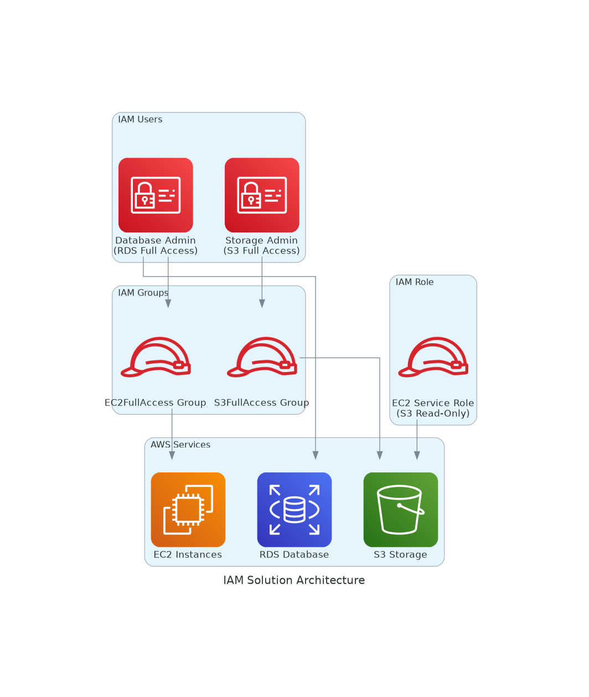

# E-Commerce Platform IAM Solution

## Real-World Scenario

TechCorp is launching a new e-commerce platform on AWS and needs to implement proper access controls for their development team. The platform consists of:

- **Database Layer**: RDS MySQL for product catalog and user data
- **Application Layer**: EC2 instances running the web application
- **Storage Layer**: S3 buckets for product images and static assets

## Team Structure & Access Requirements

### Database Administrator (Sarah)
- **Role**: Manages RDS instances, backups, and database performance
- **Access**: Full RDS permissions for database management
- **Group**: EC2FullAccess (needs EC2 access to troubleshoot connectivity)

### DevOps Engineer (Mike) 
- **Role**: Manages application infrastructure and deployments
- **Access**: Full S3 permissions for deployment artifacts and static content
- **Group**: S3FullAccess (primary responsibility for storage management)

### Application Servers
- **Role**: EC2 instances need to read configuration files and logs from S3
- **Access**: S3 read-only access via IAM role (secure, no hardcoded credentials)

## Architecture Overview

The IAM solution implements least-privilege access with:
- Individual user permissions for specialized tasks
- Group-based permissions for shared responsibilities  
- Service roles for secure application access
- Separation of concerns between database, compute, and storage management

## Implementation

The solution is implemented using multiple approaches:
- **Terraform**: Infrastructure as Code for consistent deployments
- **AWS CLI**: Command-line scripts for quick setup
- **Python**: Programmatic IAM management with boto3
- **CloudFormation**: AWS-native infrastructure templates