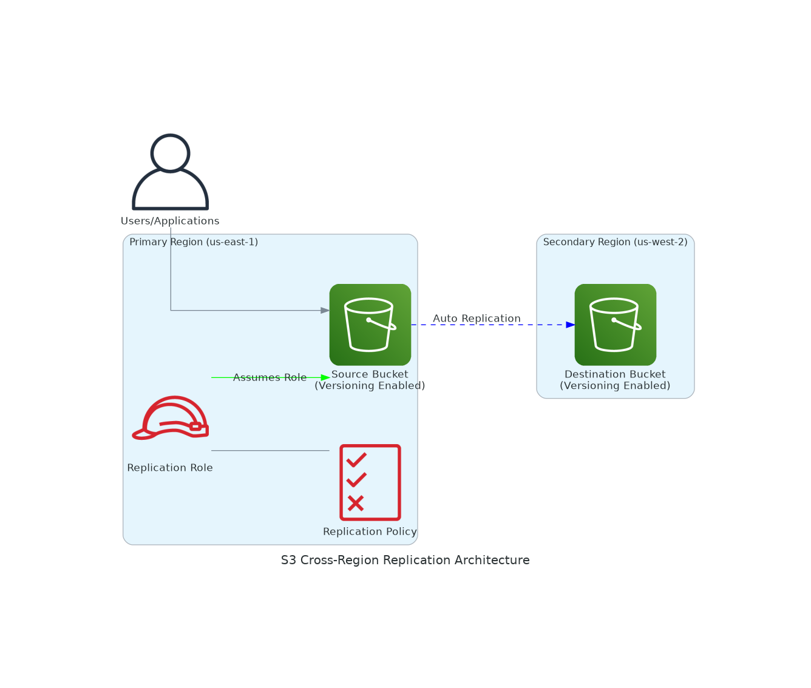

# S3 Cross-Region Replication (CRR) 🌍

## Real-World Scenario: Global Media Company Disaster Recovery

**Company**: StreamVision Media - A global streaming platform serving millions of users worldwide

**Challenge**: StreamVision stores critical video content, user data, and application assets in S3. They need to ensure business continuity and meet compliance requirements for data protection across different geographic regions.

**Requirements**:
- **Disaster Recovery**: Protect against regional outages that could impact service availability
- **Compliance**: Meet data residency requirements for European customers (GDPR)
- **Performance**: Reduce latency by serving content from geographically closer regions
- **Business Continuity**: Ensure 99.99% availability even during regional AWS service disruptions

**Solution**: Implement S3 Cross-Region Replication to automatically replicate critical data from US East (primary) to US West (disaster recovery) and EU West (compliance).

## Architecture Overview

## What This Solution Implements

This project sets up automated S3 Cross-Region Replication with the following components:

### 🏗️ Infrastructure Components
- **Source Bucket** (Primary Region): Stores original content with versioning enabled
- **Destination Bucket** (Secondary Region): Receives replicated objects automatically
- **IAM Replication Role**: Service role that S3 assumes to perform replication
- **IAM Replication Policy**: Grants necessary permissions for cross-region operations

### 🔄 Replication Features
- **Automatic Replication**: Objects uploaded to source bucket are automatically copied
- **Versioning Support**: Maintains object versions across both regions
- **Real-time Sync**: Near real-time replication (typically within 15 minutes)
- **Metadata Preservation**: Replicates object metadata, tags, and ACLs

## Business Benefits

### 💼 For StreamVision Media
- **Zero Data Loss**: RTO (Recovery Time Objective) < 1 hour, RPO (Recovery Point Objective) < 15 minutes
- **Cost Optimization**: Pay only for storage and replication, no additional compute costs
- **Compliance**: Automatic data residency compliance for international regulations
- **Scalability**: Handles petabytes of video content without manual intervention

### 📊 Key Metrics
- **Availability**: 99.999% (Five 9s) with multi-region setup
- **Replication Time**: 95% of objects replicated within 15 minutes
- **Cost**: ~$0.015 per GB replicated (one-time replication cost)

## Implementation Approaches

### 📁 Available Methods

| Method | Best For | Complexity | Time to Deploy |
|--------|----------|------------|----------------|
| **AWS CLI** | Learning & Testing | Low | 10 minutes |
| **Python (Boto3)** | Automation & Integration | Medium | 15 minutes |
| **CloudFormation** | Production Deployments | Medium | 5 minutes |
| **Terraform** | Multi-cloud Infrastructure | High | 10 minutes |

### 🚀 Quick Start
1. Choose your preferred implementation method from the folders above
2. Follow the README in each subfolder for step-by-step instructions
3. Ensure you have appropriate AWS permissions for S3 and IAM operations
4. Test replication by uploading a file to the source bucket

## Prerequisites

- AWS Account with appropriate permissions
- AWS CLI configured with credentials
- Two different AWS regions available
- S3 and IAM permissions for your AWS user/role