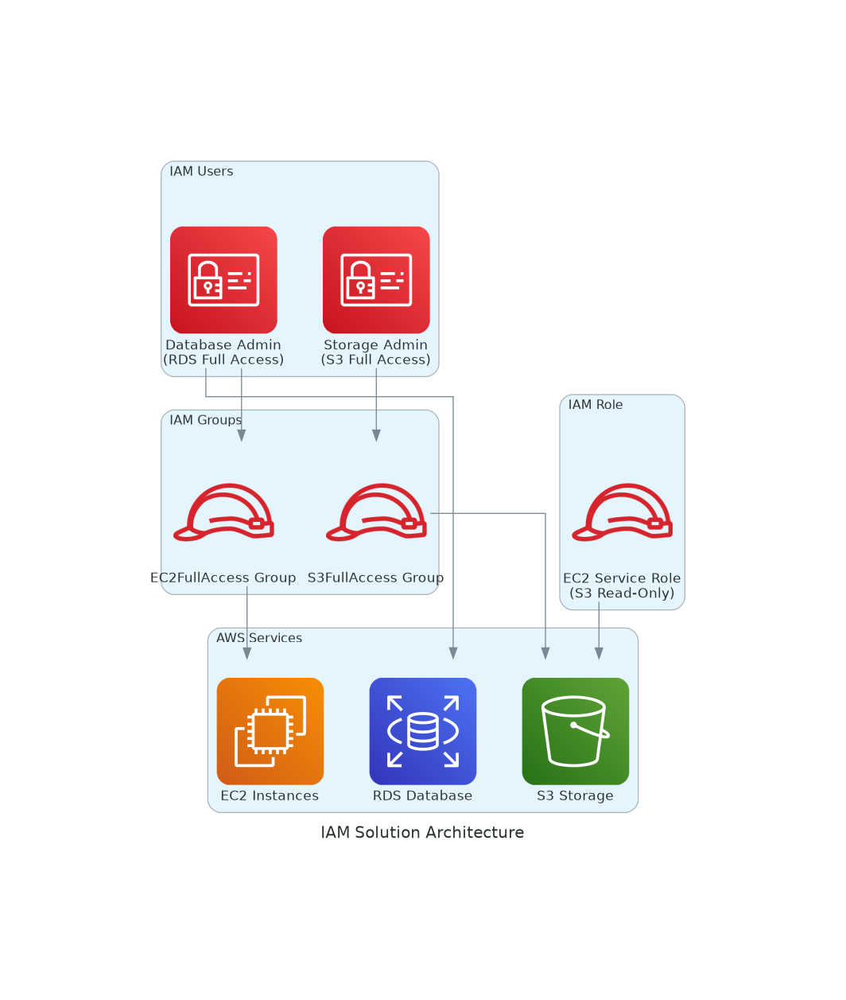

# AWS IAM Projects 🔐

This folder contains practical IAM implementations covering essential identity and access management scenarios with real-world use cases.

> **🔗 Repository**: [AWS Projects Repository](https://github.com/ldpacl/AWS) | **⬅️ Back to**: [Main README](../README.md)

## 📁 Project Overview

The project demonstrates comprehensive IAM implementation using multiple approaches: **AWS CLI**, **Python (Boto3)**, **CloudFormation**, and **Terraform**.

### 🏢 E-Commerce Platform IAM Solution
**Real-World Scenario**: TechCorp launching a new e-commerce platform with proper access controls
- **Use Case**: Multi-tier access management for development teams
- **Benefits**: Least-privilege access, role-based security, compliance
- **Implementations**: [AWS CLI](./awscli/) | [Python](./python/) | [CloudFormation](./cloudformation/) | [Terraform](./terraform/)

## 🎯 Solution Architecture

The IAM solution implements a comprehensive access control system for:

### **Database Layer** 🗄️
- **Component**: RDS MySQL for product catalog and user data
- **Admin**: Database Administrator (Sarah)
- **Access**: Full RDS permissions + EC2 access for connectivity troubleshooting

### **Application Layer** ⚙️
- **Component**: EC2 instances running the web application  
- **Access**: S3 read-only access via IAM roles (secure, no hardcoded credentials)

### **Storage Layer** 📦
- **Component**: S3 buckets for product images and static assets
- **Admin**: DevOps Engineer (Mike)
- **Access**: Full S3 permissions for deployment artifacts and content management

## 🚀 Quick Start Guide

1. **📂 Choose your preferred implementation approach**:
   - **AWS CLI**: Step-by-step command-line instructions
   - **Python**: Automated scripts using Boto3
   - **CloudFormation**: Infrastructure as Code with AWS templates
   - **Terraform**: Multi-cloud infrastructure provisioning
2. **📖 Follow the detailed README** in each implementation folder
3. **🔐 Ensure proper AWS permissions** for IAM operations
4. **🧪 Test the implementation** with the provided scenarios

## 📋 Prerequisites

- AWS Account with appropriate IAM permissions
- AWS CLI installed and configured
- Python 3.x (for Python implementations)
- Terraform (for Terraform implementations)
- Administrative access to create IAM resources

## 🎯 Learning Path Recommendations

| **Experience Level** | **Recommended Start** | **Next Steps** |
|---------------------|----------------------|----------------|
| **Beginner** | AWS CLI implementations | Python scripts |
| **Developer** | Python implementations | Infrastructure as Code |
| **Security Engineer** | CloudFormation/Terraform | Advanced policy configurations |
| **All Levels** | Architecture diagrams | Cross-service integrations |

## 🔑 Key IAM Concepts Covered

- **Users & Groups**: Individual and team-based access management
- **Roles & Policies**: Service-to-service secure communication
- **Least Privilege**: Minimal necessary permissions implementation
- **Access Patterns**: Real-world permission scenarios
- **Security Best Practices**: Industry-standard IAM configurations

## 🔗 Related Projects

- **[AWS S3](../aws_s3/)**: Simple Storage Service implementations
- **[AWS VPC](../aws_vpc/)**: Virtual Private Cloud networking projects

---

💡 **Need help?** Each implementation folder contains comprehensive documentation, troubleshooting guides, and working examples to get you started!