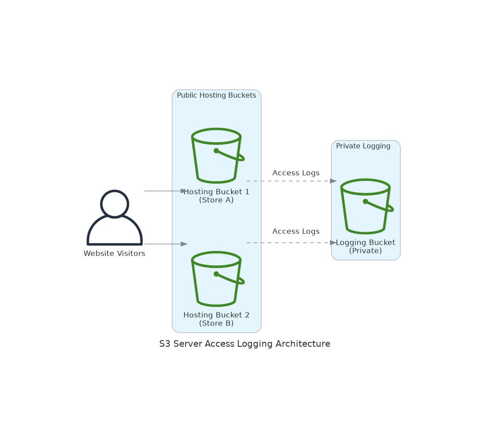

# S3 Server Access Logging 📊

## Real-World Scenario: E-commerce Platform Security & Compliance

**Company**: ShopSecure - A multi-brand e-commerce platform hosting multiple online stores

**Challenge**: ShopSecure operates two separate storefronts as static websites on S3, serving thousands of customers daily. They need comprehensive access logging for security monitoring, compliance auditing, and performance analysis.

**Requirements**:
- **Security Monitoring**: Track all access attempts to detect suspicious activity
- **Compliance**: Meet PCI DSS requirements for access logging and audit trails
- **Performance Analysis**: Monitor traffic patterns to optimize content delivery
- **Incident Response**: Detailed logs for forensic analysis during security incidents

**Solution**: Implement S3 Server Access Logging to capture detailed access logs for both hosting buckets, storing them in organized folders within a secure logging bucket.

## Architecture Overview

This project creates a secure logging infrastructure with the following components:

### 🏗️ Infrastructure Components
- **Hosting Bucket 1**: Public static website hosting for Store A
- **Hosting Bucket 2**: Public static website hosting for Store B  
- **Logging Bucket**: Private bucket storing access logs in organized folders
- **Bucket Policies**: Secure access controls for public hosting and private logging

### 📝 Logging Features
- **Detailed Access Logs**: Captures requester, bucket owner, request time, action, response status
- **Organized Storage**: Separate log folders for each hosting bucket (`logs/hostingbucket1/`, `logs/hostingbucket2/`)
- **Secure Storage**: Private logging bucket with restricted access
- **Automated Delivery**: S3 service automatically delivers logs (typically within a few hours)

## Business Benefits

### 💼 For ShopSecure
- **Security Compliance**: Meet audit requirements with comprehensive access logs
- **Threat Detection**: Identify unusual access patterns and potential security threats
- **Performance Insights**: Analyze traffic patterns to optimize website performance
- **Cost Optimization**: Monitor usage patterns to optimize storage and transfer costs

### 📊 Key Metrics
- **Log Delivery**: Logs delivered within 2-24 hours of access
- **Log Retention**: Configurable retention policies for compliance
- **Storage Cost**: ~$0.023 per GB for log storage in Standard tier

## What This Solution Implements

### 🌐 Hosting Buckets Configuration
- **Public Access**: Configured for static website hosting with public read access
- **Versioning**: Enabled for both hosting buckets
- **Website Configuration**: Index document set to `index.html`
- **Security**: Public access blocks disabled for website functionality

### 🔒 Logging Bucket Configuration  
- **Private Access**: All public access blocks enabled for security
- **Service Permissions**: S3 logging service granted write permissions
- **Organized Structure**: Separate prefixes for each hosting bucket's logs
- **Account Security**: Restricted to specific AWS account using conditions

## Implementation Approaches

### 📁 Available Methods

| Method | Best For | Complexity | Time to Deploy |
|--------|----------|------------|----------------|
| **AWS CLI** | Learning & Manual Setup | Low | 15 minutes |
| **Python (Boto3)** | Automation & Integration | Medium | 10 minutes |
| **CloudFormation** | Production Deployments | Medium | 5 minutes |
| **Terraform** | Infrastructure as Code | High | 10 minutes |

### 🚀 Quick Start
1. Choose your preferred implementation method from the folders above
2. Follow the README in each subfolder for step-by-step instructions
3. Ensure you have appropriate AWS permissions for S3 operations
4. Test logging by accessing your hosted websites and checking log delivery

## Prerequisites

- AWS Account with appropriate permissions
- AWS CLI configured with credentials
- S3 permissions for bucket creation and policy management
- Unique bucket names (S3 bucket names are globally unique)
