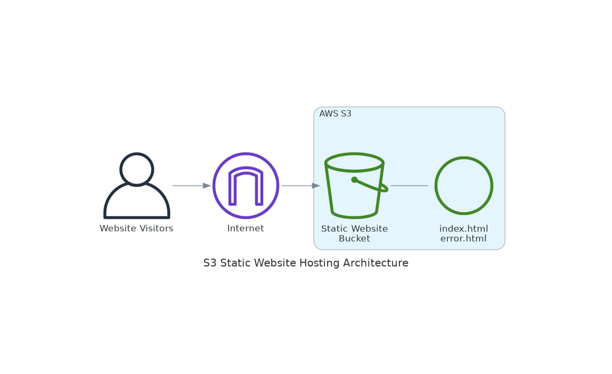

# S3 Static Website Hosting 🌐

## Real-World Scenario: Digital Marketing Agency Portfolio

**Company**: CreativeEdge - A digital marketing agency showcasing client portfolios and company services

**Challenge**: CreativeEdge needs to host multiple client portfolio websites and their own company website cost-effectively. They require fast, reliable hosting with global accessibility for their static content including HTML, CSS, JavaScript, and media files.

**Requirements**:
- **Cost-Effective Hosting**: Minimize hosting costs for static content
- **High Availability**: 99.999999999% (11 9's) durability for website files
- **Global Access**: Fast loading times for visitors worldwide
- **Easy Deployment**: Simple process to update website content
- **Custom Domain**: Professional branding with custom domain names

**Solution**: Implement S3 Static Website Hosting to serve static websites directly from S3 buckets, providing cost-effective, scalable, and highly available web hosting.

## Architecture Overview

This project creates a static website hosting infrastructure with the following components:

### 🏗️ Infrastructure Components
- **S3 Bucket**: Configured for static website hosting with public read access
- **Website Files**: HTML, CSS, JavaScript, and media files stored as S3 objects
- **Bucket Policy**: Public read access for website content
- **Website Configuration**: Index and error document settings

### 🌐 Hosting Features
- **Static Content Serving**: Direct serving of HTML, CSS, JS, and media files
- **Custom Index Document**: Configurable landing page (typically index.html)
- **Error Handling**: Custom error pages for 404 and other HTTP errors
- **Public Access**: Configured for public internet access to website content
- **HTTP Endpoint**: Automatic generation of website endpoint URL

## Business Benefits

### 💼 For CreativeEdge
- **Cost Savings**: Pay only for storage and data transfer, no server costs
- **Scalability**: Automatic scaling to handle traffic spikes
- **Reliability**: Built on AWS's highly durable infrastructure
- **Performance**: Fast content delivery with low latency
- **Maintenance-Free**: No server management or patching required

### 📊 Key Metrics
- **Durability**: 99.999999999% (11 9's) for stored objects
- **Availability**: 99.99% availability SLA
- **Cost**: ~$0.023 per GB for storage, ~$0.09 per GB for data transfer
- **Performance**: Sub-second response times for static content

## What This Solution Implements

### 🌐 Website Hosting Configuration
- **Public Access**: Bucket configured for public read access to website files
- **Website Endpoint**: S3 generates a unique website endpoint URL
- **Index Document**: Default document served when accessing the root URL
- **Error Document**: Custom error page for handling 404 and other errors

### 🔒 Security Configuration  
- **Public Read Access**: Allows public access to website content only
- **Bucket Policy**: Restricts access to read-only for website files
- **HTTPS Support**: Secure access through S3 website endpoints
- **Access Control**: Granular permissions for content management

## Implementation Approaches

### 📁 Available Methods

| Method | Best For | Complexity | Time to Deploy |
|--------|----------|------------|----------------|
| **AWS CLI** | Learning & Manual Setup | Low | 10 minutes |
| **Python (Boto3)** | Automation & Integration | Medium | 8 minutes |
| **CloudFormation** | Production Deployments | Medium | 5 minutes |
| **Terraform** | Infrastructure as Code | High | 8 minutes |

### 🚀 Quick Start
1. Choose your preferred implementation method from the folders above
2. Follow the README in each subfolder for step-by-step instructions
3. Ensure you have appropriate AWS permissions for S3 operations
4. Upload your website files and test the generated endpoint URL

## Prerequisites

- AWS Account with appropriate permissions
- AWS CLI configured with credentials
- S3 permissions for bucket creation and policy management
- Unique bucket names (S3 bucket names are globally unique)
- Website files (HTML, CSS, JavaScript, images) ready for upload
